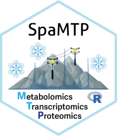
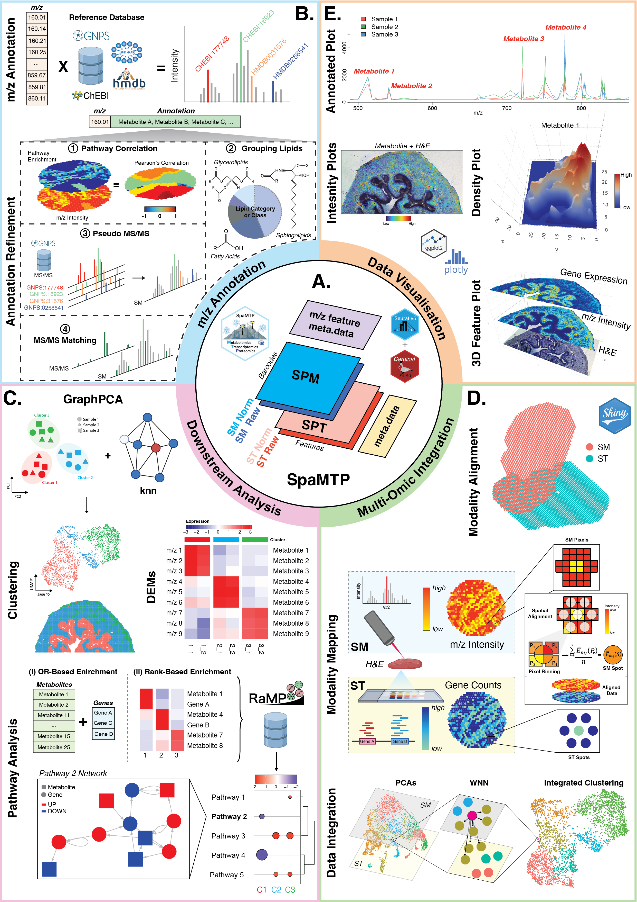

# SpaMTP 

<!-- badges: start -->


## *R*-based User-Friendly Spatial Metabolomic, Transcriptomic, and Proteomic Data Analysis Tool

<br>

<!-- badges: end -->

SpaMTP is an R package for integrative analysis of spatial metabolomics and
spatial transcriptomics data. Raw and continuous MSI spectra remain in
Cardinal's `MSImagingArrays` (unaligned mass axes) or matter-backed
`MSImagingExperiment`; aligned or binned MSI uses
`SpatialExperiment`, including `rowData()` annotations, `colData()` pixel
metadata, `spatialCoords()`, `imgData()`, and paired transcriptomes in
`altExp()`. Seurat is an optional interoperability target rather than the
package's foundation.

SpaMTP provides (1) mass-to-charge ratio (m/z) metabolite annotation, (2)
downstream statistical analysis including differential metabolite expression
and pathway analysis, and (3) integrative spatial-omics analysis. Explicit
`asSpatialExperiment()`, `asCardinal()`, `seuratToSpatialExperiment()`, and
`spatialExperimentToSeurat()` entry points connect these workflows.

The analysis package does not require Seurat. Only explicit conversion
functions use the optional SeuratObject package; loading, preprocessing,
plotting and integration do not convert inputs automatically. See
[migration status](BIOCONDUCTOR_MIGRATION.md) for validation and scientific limits.

## From modalities to a complete report

SpaMTP 0.99.9 connects native data acquisition, QC, alignment and mapping
to an analytical report: compare individual, spatial and joint representations;
evaluate region markers; inspect replicate effects and conditional cross-omic
associations; then trace pathway evidence to measured members.

```r
x <- SpaMTPData::spaMTPExampleData(paired = TRUE)
result <- runSpaMTPWorkflow(x,
  modalities = list(
    main = list(type = "metabolomics", layer = "counts"),
    transcriptome = list(type = "transcriptomics", layer = "counts")
  ), group = "region", npcs = 2, clusters = 2,
  structure = list(primary = "spatial", k_grid = c(2, 3),
                   reference = "region", umap = FALSE),
  observation_unit = "synthetic paired pixel", output_dir = "my_report")
# Open my_report/report.html; full tables and workflow.rds accompany it.
```

Supply a third alternative experiment to include another modality, or a named
list of independent SpatialExperiments with a reference and explicit alignment
and mapping geometry. RDS paths and pinned SpaMTPData resource specifications
also work. Raw-signal preprocessing and scientific design choices remain
explicit. Reports embed images; inferred contrasts require biological
replicates. See [the end-to-end tutorial](vignettes/End_to_End_Workflow.Rmd)
for independent inputs, three modalities, companion database indexes, coverage
audits and the current workflow's limits.

The offline region/DE explorer links feature selection to effect/volcano plots,
regional expression and spatial positions, with search, filters, zoom and CSV
export. Set `regions = "anatomical_region"` independently of the comparison
`group`; without biological replication, region effects remain descriptive.
Native `findAllDEMs(method="markers")` supplies pairwise AUC, standardized
effects, detection and spatial-block sensitivity. Native heatmaps and H&E
maps display the same regional markers. PCA and graph PCA use matched features
and all observations, and both feed joint representations. K sensitivity,
external-reference ARI and raw versus region-adjusted correlation make the
effects of analytical choices visible. Moran's I is an optional descriptive
screen. Small serif descriptions keep methods separate from result figures.

```r
# Extend a saved result while preserving its original contrasts:
result <- analyzeSpaMTPRegions(result, regions = "region", spatial_blocks = 6)
renderSpaMTPReport(result, "interactive_report",
  preview_points = 2000, preview_features = 180, table_rows = 1000)
```

The same entry points accept paired mouse brain MS/RNA resources, single-omic
MS or Visium inputs, and three-modality experiments. The tutorial and installed
`workflows/` recipes include
`mouse_brain_dhb_striatum`, `mouse_brain_fmp10` and `mouse_brain_visium`
configurations using pinned SpaMTPData resources; no cohort-specific logic is
required. Pathways require a compatible species-specific index from the
configured database; human HGNC identities are not assigned to mouse genes.

## Moving a Seurat workflow to Bioconductor

Convert once, then keep the result in a Bioconductor container:

```r
# xy has numeric x/y columns and row names matching Seurat pixel names.
spe <- seuratToSpatialExperiment(
    seuratObject, assay = "SPM", layer = "counts", coordinates = xy)
spe <- normalizeSMData(spe, "LogNormalize", verbose = FALSE)
spe <- scaleSMData(spe)
spe <- runMetabolicPCA(spe, slot = "logcounts")

# Non-spatial transcriptomics does not need invented coordinates.
sce <- seuratToSingleCellExperiment(seuratObject, assay = "RNA")
```

| Operation in a Seurat workflow | Native alternative |
|---|---|
| NormalizeData | normalizeSMData: normcounts/logcounts assays |
| ScaleData | scaleSMData: feature-wise centring/scaling in a scaled assay |
| RunPCA | runMetabolicPCA / scater::runPCA: reducedDim |
| VlnPlot | mzViolinPlot / scater::plotExpression |
| Cell/feature metadata | colData / rowData |
| Multiple modalities | Paired altExp entries |
| Subsetting cells | Standard brackets, or subsetSPM with colData/colLabels |
| FindMultiModalNeighbors | multiOmicIntegration supplies a **different**, equal-weight PCA embedding, not WNN |

Conversion preserves the requested exact layer, metadata, identities and
paired alternative assays. It does not transfer optical rasters, graphs or
reductions. Split Seurat v5 layers must be joined beforehand or selected
explicitly. Other assays without the same pixels are skipped with a warning.
The original layer name is retained: a converted data layer is still called
data, so either select it explicitly or normalize counts to create logcounts.
Scaling creates a dense matrix; it is not an out-of-memory operation.

Optical images can be attached with addSpatialImage(). To return to an
external Seurat workflow, explicitly call spatialExperimentToSeurat().
Historical Seurat/WNN tutorials belong to the published-workflow branch.

For runnable native examples, see [modern data access](vignettes/Modern_Data_Access.Rmd)
and the [full annotation pipeline](vignettes/Metabolite_Annotation_Pipeline.Rmd).
Spatial coordinates have one authoritative store: `spatialCoords()`.
Seurat conversion reads a single image/FOV through `GetTissueCoordinates()`
before considering historical metadata copies; multiple images require an
explicit selection. Native matrix and METASPACE imports no longer duplicate
coordinates in pixel metadata.

Please head to the [**SpaMTP website**](https://genomicsmachinelearning.github.io/SpaMTP/) for tutorials and documentation, including the [**RaMP 3.0 indexed metabolite annotation pipeline**](https://genomicsmachinelearning.github.io/SpaMTP/developmental/articles/Metabolite_Annotation_Pipeline.html). Active development and website deployment remain in the [**project development repository**](https://github.com/GenomicsMachineLearning/SpaMTP/tree/developmental); this repository contains the streamlined Bioconductor package source.

SpaMTP is now published in *Nature Methods*: [**SpaMTP: integrative statistical analysis and visualization of spatial metabolomics and transcriptomics data**](https://doi.org/10.1038/s41592-026-03140-8).

<br>



<br>

## Installation

Keep the coordinated source versions together: SpaMTP >= 0.99.9,
SpaMTPdb >= 0.99.4 and SpaMTPData >= 0.99.5. For local sibling checkouts,
install the data packages before the software package:

```sh
R CMD INSTALL ../SpaMTPdb
R CMD INSTALL ../SpaMTPData
R CMD INSTALL .
```

The [three-package workflow](vignettes/SpaMTP_Companion_Workflow.Rmd) runs
without downloads using SpaMTPData's native synthetic SpatialExperiment,
SpaMTPdb's registry and SpaMTP's analysis/annotation functions. Data packages
remain independent of the software package; conversion logic stays in SpaMTP.
The RaMP 3.0.7 snapshot and historical experiment-data 1.0.0 remain unchanged.
SpaMTPData now defaults to resource release 1.1.0, with seven native
SpatialExperiment RDS in [Zenodo record 22733262](https://zenodo.org/records/22733262)
and eleven unchanged auxiliary/Cardinal resources. Use `spaMTPData()` to
retrieve native datasets without Seurat. Installed mouse-brain recipes and the
network demo use this native release directly. Preparation accepts optional
independent optical images with explicit scale factors; FMP10/Visium mapping
also requires an explicit spot radius in original image pixels. Historical
archives are not loaded by these examples. See the
[end-to-end workflow](vignettes/End_to_End_Workflow.Rmd) for the portable commands
and spatial-configuration format. Historical resources remain available only
through an explicit `version = "1.0.0"` request.

For human gene mapping, see the [gene identifier workflow](vignettes/Gene_Identifier_Mapping.Rmd).
SpaMTPdb supplies a separately versioned, checksum-verified HGNC archive;
SpaMTPData supplies experiments with species provenance. SpaMTP's
`buildGeneMappingIndex()`, `mapGeneIdentifiers()` and
`annotateGeneIdentifiers()` resolve symbols and stable IDs with an input audit.
Pathway analyses unite memberships of RaMP records belonging to one HGNC gene
and count that gene once. Ambiguous aliases and conflicting gene records remain
explicitly unresolved. Targeted-panel Fisher analysis requires the full measured
panel as `universe`; all eligible pathways enter the BH correction.

Use `buildPathwayIndex(database, gene_index = index)` and pass the resulting
`pathway_index` to enrichment, `createPathwayAssay()`, `createPathwayObject()`
and named pathway plots. Coverage audits report database and measured sizes,
actual member IDs, coverage fractions and excluded identity conflicts.
Different pathways with the same name remain distinct through pathwayRampId.
Pathway scores describe measured expression and are not pathway activity tests.

During Bioconductor review, install the companion annotation package and this
submission source from GitHub:

``` r
if (!requireNamespace("remotes", quietly = TRUE))
    install.packages("remotes")

remotes::install_github("BCRL-tylu/SpaMTPdb")
remotes::install_github("BCRL-tylu/SpaMTPData")
remotes::install_github("SpaMTP-project/SpaMTP")
```

`SpaMTPdb` supplies versioned RaMP annotation and pathway resources.
`SpaMTPData`, installed separately when demonstration data are required,
provides ExperimentHub access to the larger objects used in tutorials.

After Bioconductor acceptance, the supported installation command will be:

``` r
if (!requireNamespace("BiocManager", quietly = TRUE))
    install.packages("BiocManager")

BiocManager::install("SpaMTP")
```

For tutorials and more information please visit the [SpaMTP website](https://genomicsmachinelearning.github.io/SpaMTP/)

## Citation

If SpaMTP contributes to your work, please cite:

> Causer, A., Lu, T., Kriel, J. *et al.* SpaMTP: integrative statistical analysis and visualization of spatial metabolomics and transcriptomics data. *Nature Methods* **23**, 1501–1506 (2026). https://doi.org/10.1038/s41592-026-03140-8

The citation can also be retrieved directly in R:

``` r
citation("SpaMTP")
```

## Maintainer

SpaMTP is currently maintained by **Tianyao Lu** ([GitHub](https://github.com/BCRL-tylu), [email](mailto:lu.t@wehi.edu.au)). **Andrew Causer** remains credited as an original author and former maintainer.

Pathway membership, topology provenance, the interaction-code correction, and
rebuild instructions are documented in
[Pathway Database Integration](vignettes/Pathway_Database_Integration.Rmd).
